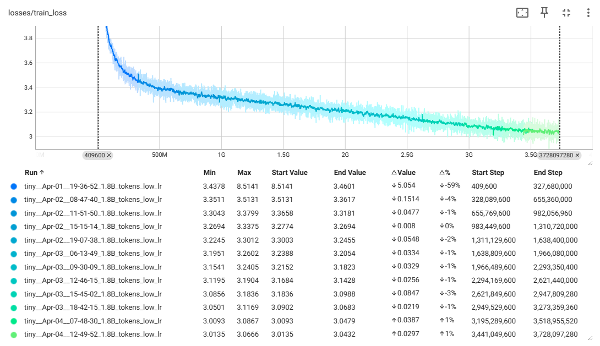

# nano-llama
Home dummy project of transformer decoder models of various sizes trained on [2.6M news articles](https://components.one/datasets/all-the-news-2-news-articles-dataset) on Google's free T4 GPU. The training process involved three main stages:

1. Pre-training on 1.87B tokens of cleaned data for two epochs. 
2. Supervised fine-tuning for one epoch on selected 25K articles with length between 128 and 256 tokens. 
3. Direct Preference Optimization on generated articles that were judged by ChatGPT (However model was too small to be further fine-tuned so I only implemented training logic.)

Below is the loss during pre-training for the 29M-parameter model. Training took approximately 30 hours in fp16 precision. The model was trained with roughly an order of magnitude of 10^18 FLOPs (~1000 times less than GPT-2). Scaling laws from the Chinchilla paper do not apply for at least two reasons: 1) The dataset was only from one domain and very small compared to regular pre-training settings. 2) Instead of training for one epoch on all of the data, I trained the model for two epochs, which likely resulted in a lower loss than expected.

